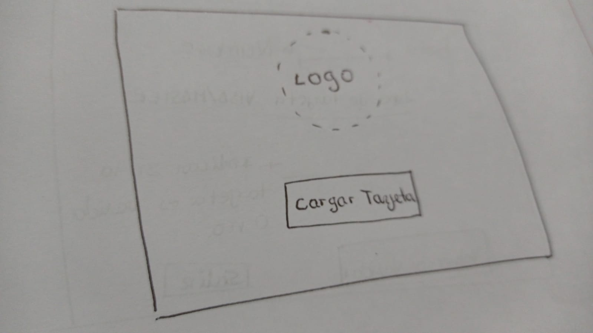
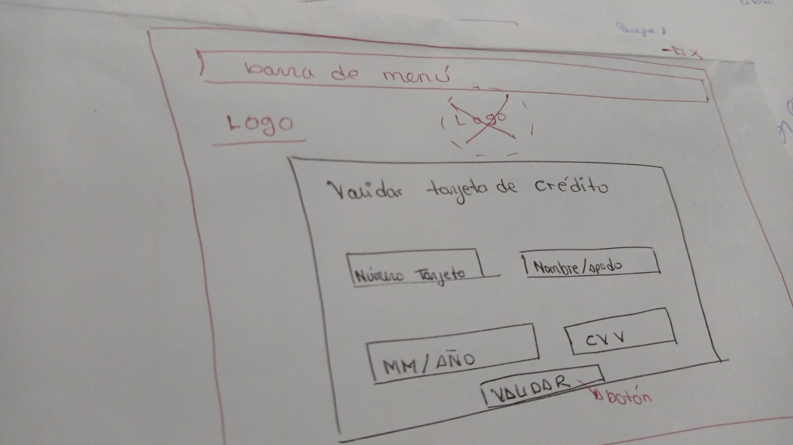
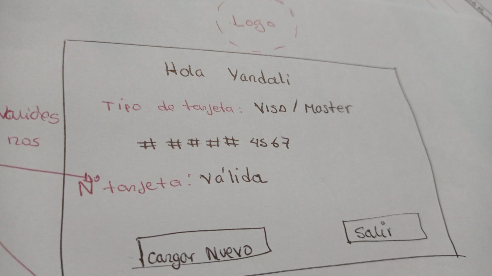
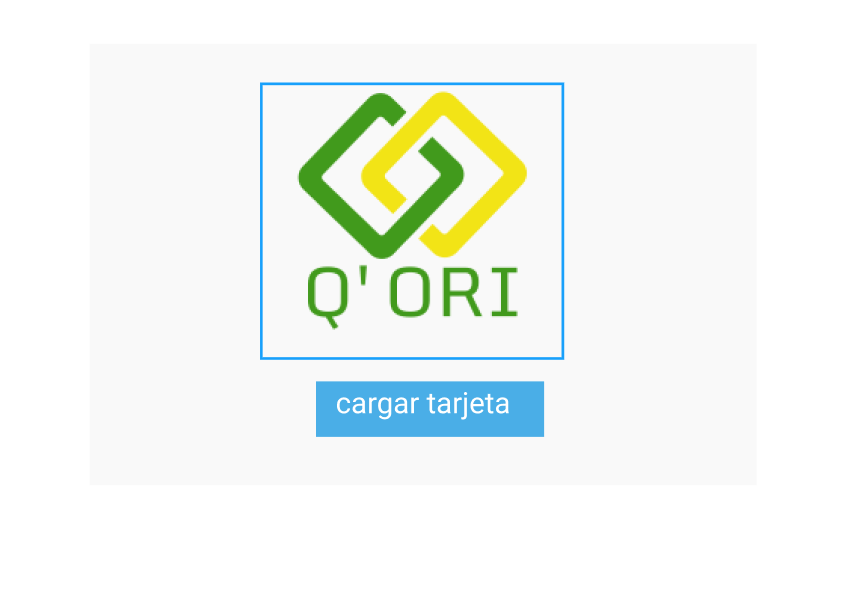
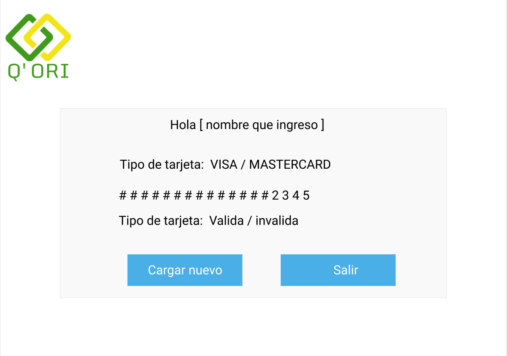
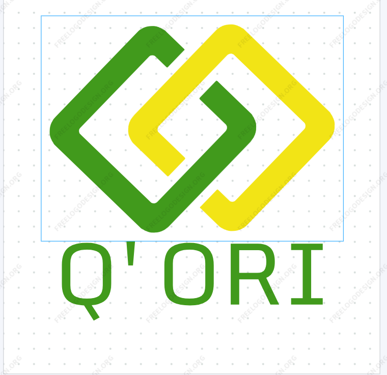

# Tarjeta de crédito válida Q'ORI

## Índice

* [1. Autor](#1-autor-✒️)
* [2. Titulo Del Proyecto](#2-titulo-del-proyecto-✨)
* [3. Descripción](#3-descripción-📋)
* [4. Construcción](#4-construcción-🛠️)
* [5. Diseño](#5-diseño-✍)
* [6. Bibliografia](#6-bibliografian-📖)
* [7. Agradecimiento](#7-agradecimiento-🤗)

## 1. Autor ✒️

Yandali Damian Elguera

## 2. Titulo Del Proyecto ✨

Tarjeta de crédito válida Q'ORI

## 3. Descripción 📋

En este proyecto se realizó una aplicacion web para que el usuario pueda validar el numero de su tarjeta y luego guadar en una billetera digital donde le sera posible guadar sus tarjetas fisicas en una apliacion y con ello hacer sus pagos en centros comerciales donde esten asociados/ autorizados.

* Marca: Q'ORI.
* Ventanas: Se consideró 3 ventanas de navegacion.
* colores: verde, azul, blanco, negro y amarillo.

## 4. Construcción 🛠️

En este proyecto se uso las siguientes herramientas para el desarrollo.

* HTML
* JAVASCRIPT
* CSS
* FIGMA
* NODE

## 5. Diseño ✍

El diseño se realizo de la siguiente manera: 

### a. prototipo en papel

 
 
 

### b. Prototipo en figma

 
 
 

### c. Logo

 

## 6. Bibliografia 📖

<https://www.w3schools.com/html/>

<https://developer.mozilla.org/es/docs/Web/API/Document/querySelector>

<https://lenguajejs.com/javascript/dom/que-es/>

<https://uniwebsidad.com/libros/css/capitulo-2/selectores-basicos>

<https://editor.freelogodesign.org/es/logo/edit/b3784f1710bb4d86b183847bcd4549f6?template=1289&category=1&companyName=Q%27ORI>

<https://www.figma.com>

<https://cursosgratis.com.mx/marketing-digital/iconos-seo-para-titulos-en-google-y-youtube/>

<https://gist.github.com/rxaviers/7360908>

## 7. Agradecimiento 🤗

* Agradesco primero a Dios y a toda la comunidad Laboratorian en especial a los Coaches.
* Agradesco a mis compañeras de mi Squad con quienes formamos una gran amistad y quienes me impulsaron a seguir adelante a pesar de las adversidades.
* Agradesco a mi familia quienes siempre me dan su apoyo incondicional.
